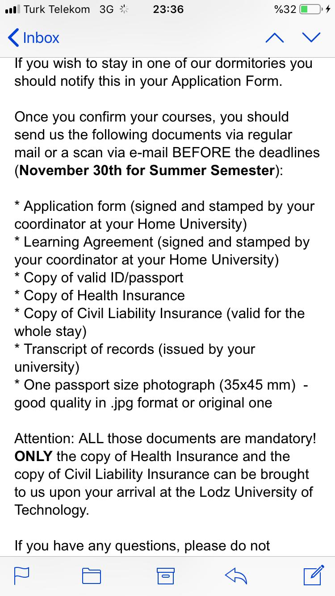
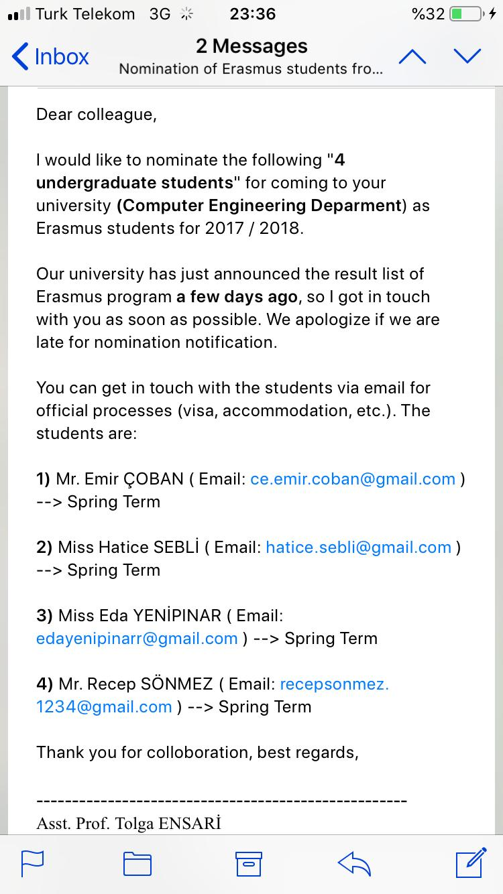

# 🛫 Polonya'da Erasmus

## 👮‍ Yapman Gerekenler

- [Ders Denkliği Formu](https://muhendislik.istanbulc.edu.tr/tr/content/ogrenci/erasmus-programi)'nu doldurup [Mitat Bey](mailto:mitat.adeka@istanbul.edu.tr)'e mail atmak
- Lodz University **Date Line**'a bakmak

> Sorularımı **Zeynep ORMAN**'a sormam gerekmekte.

## ❔ İhtiyacın Olacaklar

- Yurt
- İklim bilgisi

## 🕵️‍ Ufak Analizler

| Kavram                                    | Açıklama                               |
| :---------------------------------------- | :------------------------------------- |
| [ErasmusDorm](http://erasmusdorm.com/en/) | Kaliteli bir yurt, yer kalmayabiliyor. |

## 🔗 Faydalı Bağlantılar

- [Erasmus Polonya Tüyo](http://www.polonyam.com/erasmus-polonya-tuyo/)

