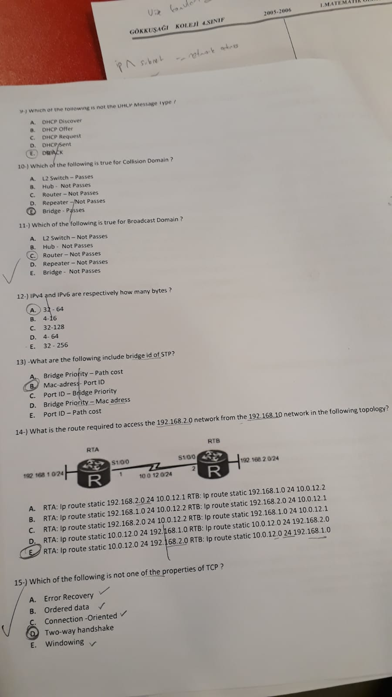

# Hauwei Dersi <!-- omit in toc -->

Adı sonradan değiştirilmeli 🤔

> Notlar tam değildir, katıldığım (ve dinlediğim 😄) kısımlar yazılmıştır.

## Yazılım Notları

- `eNSP` Hauwei'nin sunduğu *network* similasyın uygulaması

## Temel Kavramlar

| Kavram          | Açıklama                                                                         |
| --------------- | -------------------------------------------------------------------------------- |
| IP Adresi       | İnternete bağlanma adresimiz                                                     |
| SubnetMask      | Kimlik ve grupları ayırmak için kullanılır                                       |
| Default Gateway | İki farklı *network*'ün iletişimini sağlar, local networkten çıkış IP'si aynıdır |
| Subnet ID       | Last IP & (logic and) SubnetMask                                                 |

### SubnetMask Host ve Bit Hesaplamaları

$255.255.b.a$ olan subnetmask için:

- $host = (256 - b)(256 - a) - 2$
- $bit = 32 - log_2 (host + 2)$

### IPv4 Classes

$IP.0.0.0$ için temel formül:

- $IP_{class} = IP_{class - 1} + 2^{8 - harf}$
  - $harf$ A -> 0 olmak üzere alfabetik sıra
  - $IP_{0} = 0$

| Class | IP Karşılığı | Artış |
| ----- | ------------ | ----- |
| A     | 0.0.0.0      | 0     |
| B     | 128.0.0.0    | 128   |
| C     | 192.0.0.0    | 64    |
| D     | 224.0.0.0    | 32    |
| E     | 240.0.0.0    | 16    |

## Layer Özellikleri

| Layer2                                 | Layer3                                                                                 |
| -------------------------------------- | -------------------------------------------------------------------------------------- |
| Aynı *network*'teki haberleşme (local) | Farklı *network*'teki haberlerşme                                                      |
| Modemlerdeki *LAN* portlarının katmanı | Modemdeki *ADSL* portunun katmanı                                                      |
| *Switch* ile gerçekleşir               | *Router* ile gerçekleşir                                                               |
| *MAC* adresleri ile haberleşilir       | Asıl hedefe *IP* adresi ile gidilir, *MAC* adresleri hedefe gidiş sırasında kullanılır |
| *Gateway* olmaz                        | *Gateway* olur                                                                         |

- *Router*, *switch*lerin haberleşmesini sağlar
- *switch*, aynı ağdaki bilgisayarların haberleşmesini sağlar
- *Gateway*, asıl hedefini belirtir ve hedefe giderken başka yerlere gitmesiyle ilgilnemez bilgisi olmaz. (kargo şirkerlerine paket vermek gibi)

## *MAC* varken Neden *IP* Adresi Var

- Paket alışverisi *IP* adresi ile yapılmaktadır (layer3)
- Router arasında aktarım yapılırken, Source *MAC* adresi sabit kalarak, Destination *MAC* adresleri değişmektedir
  - Source *MAC*, kaynağın kimliğini tutar
  - Destination *MAC*, paketin gönderileceği kaynağın adresini tutar.
  - *IP*, asıl kaynağın sanal adresini tutar
- Her kaynak bildiği hedefe paketi yollar (gateway yapısı)
  - Bildiği adres olarak ifade edilen *MAC* adresidir

## RIP - Routing Information Protocol

- Interior Gateway Protocol (IGP)
- Distance vector algorithm
- Ufak çaplı *network*'lerde kullanılır

| Rip - 1                              | Rip - 2                                         |
| ------------------------------------ | ----------------------------------------------- |
| Classful routing protocol            | Classless routuing protocol                     |
| Broadcast route updates              | Multicast route updates 224.0.0.9               |
| UDP 520 port send and recieve packet | UDP 520 port send and recieve packet            |
| Metric (Hop count)                   | Metric (Hop count)                              |
|                                      | Support external route tag, route summarization |
|                                      | Specified next hop and authentication (MD5)     |
|                                      | Classless inter-domain routing (CIDR)           |

### RIP-2 Özellikleri

- Timer
- Split Horizon
- Poison Reverse
- Trigger Update
  - Route bilgisi değişirse hemen güncelleme paketini komşusuna gönderir

### RIP-2 Örneği

Temel sistem:

- `rip`
- `version 2`
- `network <network_id>`
  - Kaç *network*'e bağlıysa o kadar `network ...` komutu yazılır
  - `<network_id>` sonu `.0` olan IP adresidir
- `quit`

## OSPF Open Shortest Part First

- Link state interior gateway protocol
- SPF Algorith
- Kurumsal *network*'lerde kullanılır

## Sınav Soruları

> © Copyright ~ Sena Modanlıoğlu

